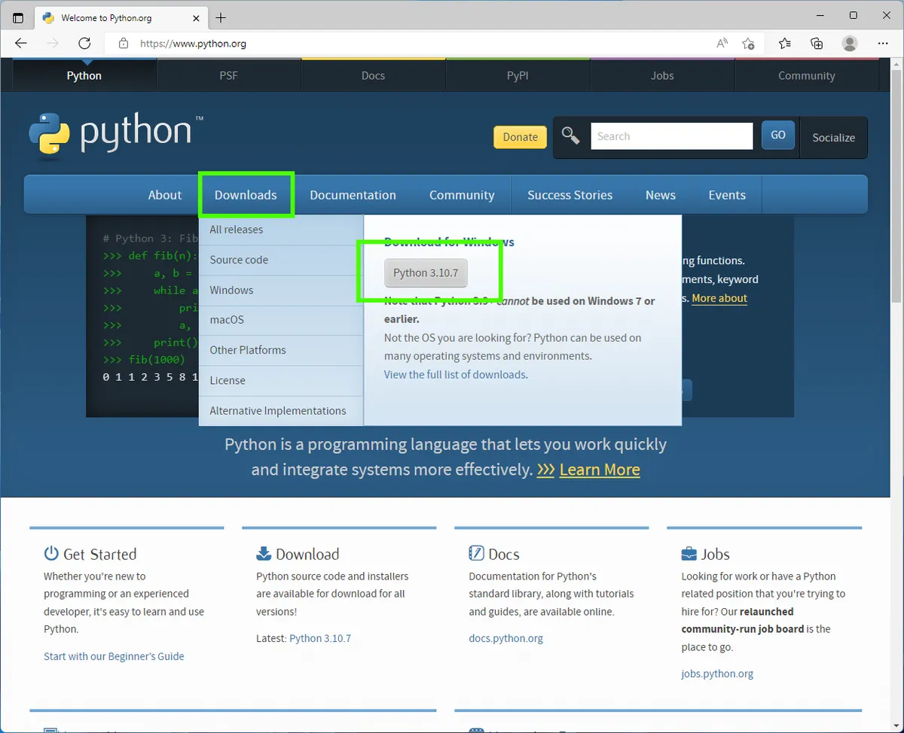
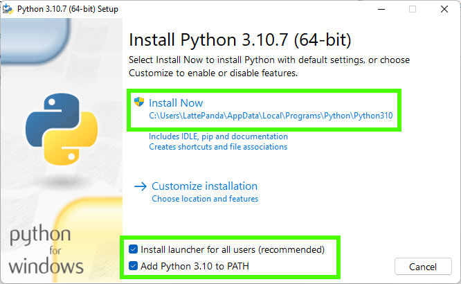
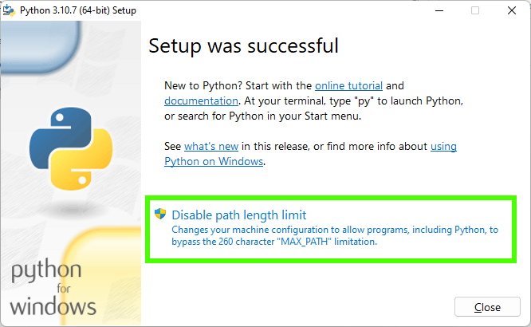
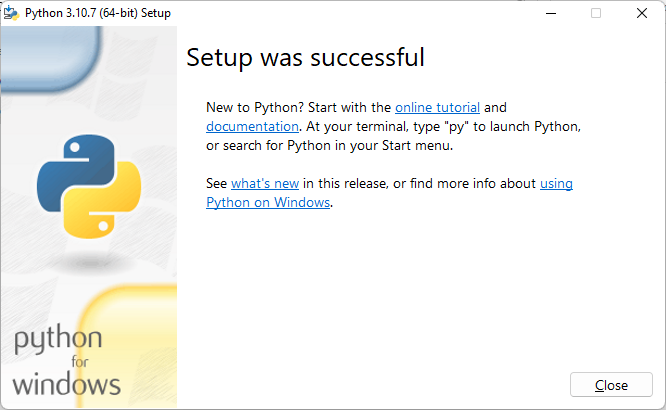

[](https://classroom.github.com/a/WfNmjXUk)
[](https://classroom.github.com/online_ide?assignment_repo_id=15327803&assignment_repo_type=AssignmentRepo)
# SE-Assignment-6
 Assignment: Introduction to Python
Instructions:
Answer the following questions based on your understanding of Python programming. Provide detailed explanations and examples where appropriate.

 Questions:

1. Python Basics:
   - What is Python, and what are some of its key features that make it popular among developers? Provide examples of use cases where Python is particularly effective.
      
       Python: A Versatile Language for Diverse Applications

   Python is a high-level, general-purpose programming language known for its readability, simplicity, and versatility. Here's a breakdown of its key features and use cases:

   Key Features that Make Python Popular:

   *Readability: Python's clear and concise syntax, with a focus on whitespace and indentation, makes code easy to read and maintain, both for yourself and others.
   *Large Standard Library: Python comes with a rich collection of built-in modules and libraries that provide functionalities for various tasks, reducing the need to write everything from scratch.
   *Cross-Platform Compatibility: Python code can run on different operating systems (Windows, macOS, Linux) without major modifications.
   *Large and Active Community: Python boasts a vast and supportive community of developers, offering extensive resources, tutorials, and libraries.

   Use Cases for Python:

   *Web Development: Python frameworks like Django and Flask power some of the most popular websites due to their rapid development capabilities and clean syntax.
   * Data Science and Machine Learning: Libraries like NumPy, Pandas, Scikit-learn, and TensorFlow make Python a go-to language for data analysis, manipulation, and building machine learning models.
   *Automation and Scripting: Python excels at automating repetitive tasks, from file management and data processing to system administration.
   *Scientific Computing: Libraries like SciPy and Matplotlib provide tools for numerical computations, data visualization, and scientific simulations.

   Examples:

   *Web Scraping: Python can be used to extract data from websites for various purposes, such as market research or price comparison.
   *Data Analysis: Businesses use Python to analyze large datasets, identify trends, and make data-driven decisions.
   *Machine Learning Applications: From spam filtering to recommendation systems, Python is a popular choice for building and deploying machine learning models.
   *Game Development: Frameworks like Pygame allow you to create engaging games using Python's clear syntax.

   In Conclusion:

   Python's combination of readability, powerful libraries, and diverse use cases makes it a popular and valuable tool for programmers of all levels. Whether you're building a website, analyzing data, or automating tasks, Python offers a flexible and efficient approach to programming.


2. Installing Python:
   - Describe the steps to install Python on your operating system (Windows, macOS, or Linux). Include how to verify the installation and set up a virtual environment.
   The following is how to install python in Windows 11:
      1. Open a browser to the Python website and download the Windows installer. 
      

      2.  Double click on the downloaded file and install Python for all users, and ensure that Python is added to your path. Click on Install now to begin. Adding Python to the path will enable us to use the Python interpreter from any part of the filesystem.
      

      3. After the installation is complete, click Disable path length limit and then Close. Disabling the path length limit means we can use more than 260 characters in a file path.
      

      4. Click Close to end the installation.
      
      
   The following can be used to verify if the python installation was successful:
      1. Open Command Prompt: Press Win + R, type cmd, and press Enter.
      2. Check Python Version: python --version
      3. This should output the installed Python version, e.g., Python 3.10.0.
      4. Check Pip Version: pip --version
      5. This should output the installed Pip version, e.g., pip 21.0.1.

   The following are steps to set up the virtual environment:

   A virtual environment is an isolated environment that allows you to manage dependencies for different projects separately. This ensures that each project can have its own set of packages, without interference from others.
   Here's how to create a virtual environment. The following commands can be used 'virtualenv' or 'venv' (available in Python 3.3+):

      1. Open a terminal or command prompt.

      2. Navigate to the directory where you want to create your virtual environment.

      3. To create the virtual environment, run the following command, python3 -m venv myenv
      4. Once created activate the virtual environment using the following command 'source myenv/Scripts/activate'
      5. Deactivate the Virtual Environment:

         To deactivate the virtual environment and return to your global Python environment, simply run: 'deactivate'


3. Python Syntax and Semantics:
   - Write a simple Python program that prints "Hello, World!" to the console. Explain the basic syntax elements used in the program.

      print("Hello, World!")

   Explanation of Basic Syntax Elements

1. `print` Function:
   - The `print` function is a built-in Python function that outputs text to the console. In Python, functions are called using their name followed by parentheses `()`.

2. Parentheses `()`:
   - The parentheses are used to enclose the arguments passed to the function. In this case, the argument is the string `"Hello, World!"`.

3. String `"Hello, World!"`:
   - A string is a sequence of characters enclosed in either single quotes (`'`) or double quotes (`"`). Here, `"Hello, World!"` is a string literal passed as an argument to the `print` function.

4. Quotation Marks `""`:
   - Double quotes are used to define the beginning and end of the string. Python also allows single quotes to define strings, but it's important to match the starting and ending quotes.

5. Indentation:
   - Although not explicitly shown in this simple program, indentation is significant in Python and is used to define the scope of loops, functions, and conditional statements. For example, code blocks within a function or loop are indented.

   Full Example in Context

   This is a simple Python program to print "Hello, World!" to the console

# Define a main function
def main():
    # Print the message to the console
    print("Hello, World!")

# Call the main function
if __name__ == "__main__":
    main()


   Explanation of Extended Example

1. Comments `#`:
   - Comments in Python start with the `#` character and are used to add explanations or notes in the code. They are not executed by the interpreter.

2. Function Definition `def`:
   - The `def` keyword is used to define a function. In this example, `main` is the name of the function, and the parentheses `()` indicate that it takes no parameters.

3. Function Body:
   - The body of the function contains the `print` statement, indented to indicate that it is part of the function.

4. Main Check `if __name__ == "__main__":`:
   - This line checks if the script is being run directly (as opposed to being imported as a module in another script). If true, it calls the `main` function.
   - `__name__` is a special variable in Python that holds the name of the current module. When a script is run directly, `__name__` is set to `"__main__"`.


4. Data Types and Variables:
   - List and describe the basic data types in Python. Write a short script that demonstrates how to create and use variables of different data types.

   Basic Data Types in Python

      Python has several built-in data types that allow you to store and manipulate different kinds of data. Here are some of the most commonly used data types:

      1. Integer (`int`)**:
      - Represents whole numbers, positive or negative, without a decimal point.
      - Example: `42`, `-7`

      2. Floating-Point Number (`float`)**:
      - Represents real numbers, positive or negative, with a decimal point.
      - Example: `3.14`, `-0.001`

      3. String (`str`):
      - Represents sequences of characters enclosed in single quotes (`'`) or double quotes (`"`).
      - Example: `"Hello, World!"`, `'Python'`

      4. Boolean (`bool`):
      - Represents truth values: `True` or `False`.
      - Example: `True`, `False`

      5. List (`list`):
      - Represents an ordered, mutable collection of elements, which can be of any data type.
      - Example: `[1, 2, 3]`, `["apple", "banana", "cherry"]`

      6. Tuple (`tuple`):
      - Represents an ordered, immutable collection of elements, which can be of any data type.
      - Example: `(1, 2, 3)`, `("apple", "banana", "cherry")`

      7. Dictionary (`dict`):
      - Represents an unordered collection of key-value pairs, where the keys are unique.
      - Example: `{"name": "John", "age": 30}`, `{"apple": 1, "banana": 2}`

      8. Set (`set`):
      - Represents an unordered collection of unique elements.
      - Example: `{1, 2, 3}`, `{"apple", "banana", "cherry"}`

   Script Demonstrating Different Data Types

      # Integer
      age = 25
      print("Integer:", age)

      # Float
      price = 19.99
      print("Float:", price)

      # String
      name = "Alice"
      print("String:", name)

      # Boolean
      is_student = True
      print("Boolean:", is_student)

      # List
      fruits = ["apple", "banana", "cherry"]
      print("List:", fruits)

      # Tuple
      coordinates = (10.0, 20.0)
      print("Tuple:", coordinates)

      # Dictionary
      person = {
         "name": "John",
         "age": 30,
         "is_student": False
      }
      print("Dictionary:", person)

      # Set
      unique_numbers = {1, 2, 3, 2, 1}
      print("Set:", unique_numbers)

   Explanation

   1. Integer: 
   - `age = 25`
   - The variable `age` is assigned the integer value `25`.

   2. Float:
   - `price = 19.99`
   - The variable `price` is assigned the floating-point number `19.99`.

   3. String:
   - `name = "Alice"`
   - The variable `name` is assigned the string `"Alice"`.

   4. Boolean:
   - `is_student = True`
   - The variable `is_student` is assigned the boolean value `True`.

   5. List:
   - `fruits = ["apple", "banana", "cherry"]`
   - The variable `fruits` is assigned a list containing three strings: `"apple"`, `"banana"`, and `"cherry"`.

   6. Tuple:
   - `coordinates = (10.0, 20.0)`
   - The variable `coordinates` is assigned a tuple containing two floating-point numbers: `10.0` and `20.0`.

   7. Dictionary:
   - `person = {"name": "John", "age": 30, "is_student": False}`
   - The variable `person` is assigned a dictionary with three key-value pairs.

   8. Set:
   - `unique_numbers = {1, 2, 3, 2, 1}`
   - The variable `unique_numbers` is assigned a set containing the unique elements `1`, `2`, and `3`. Duplicates are automatically removed.


5. Control Structures:
   - Explain the use of conditional statements and loops in Python. Provide examples of an `if-else` statement and a `for` loop.


   Conditional statements allow you to execute certain parts of your code based on whether a condition is true or false. The most common conditional statements in Python are `if`, `elif`, and `else`.

 `if-else` Statement Example


# Example of an if-else statement
age = 18

if age >= 18:
    print("You are an adult.")
else:
    print("You are not an adult.")


 Explanation

   1. `if` Statement:
   - The `if` statement checks a condition (in this case, `age >= 18`). If the condition is true, the indented code block following the `if` statement is executed.
   
   2. `else` Statement:
   - The `else` statement provides an alternative code block to execute if the condition in the `if` statement is false.

 `if-elif-else` Statement Example


# Example of an if-elif-else statement
grade = 85

if grade >= 90:
    print("You got an A!")
elif grade >= 80:
    print("You got a B!")
elif grade >= 70:
    print("You got a C!")
else:
    print("You need to improve.")


 Explanation

   1. `elif` Statement:
   - The `elif` (short for "else if") statement checks another condition if the previous `if` or `elif` condition was false. You can have multiple `elif` statements.
   
   2. Execution Flow:
   - The first `if` or `elif` condition that evaluates to true will have its code block executed. If none of the conditions are true, the `else` block will be executed.

 Loops in Python
Loops allow you to execute a block of code multiple times. The most common loops in Python are `for` loops and `while` loops.

 `for` Loop Example

# Example of a for loop
fruits = ["apple", "banana", "cherry"]

for fruit in fruits:
    print(fruit)

    Explanation

   1. `for` Loop:
   - The `for` loop iterates over a sequence (such as a list, tuple, string, or range) and executes the indented block of code for each item in the sequence.
   
   2. Loop Variable:
   - In this example, `fruit` is the loop variable that takes on the value of each item in the `fruits` list during each iteration of the loop.

 `while` Loop Example:

  Example of a while loop
count = 1

while count <= 5:
    print("Count:", count)
    count += 1


    Explanation

   1. `while` Loop:
   - The `while` loop repeatedly executes the indented block of code as long as the condition is true.
   
   2. Loop Condition:
   - In this example, the condition is `count <= 5`. The loop will continue to execute as long as `count` is less than or equal to 5.
   
   3. Increment:
   - `count += 1` increments the value of `count` by 1 in each iteration to eventually break the loop when `count` exceeds 5.

   Combined Example

 Here is an example that combines conditional statements and loops:

# Using a for loop with an if-else statement
numbers = [1, 2, 3, 4, 5, 6, 7, 8, 9, 10]

for number in numbers:
    if number % 2 == 0:
        print(f"{number} is even.")
    else:
        print(f"{number} is odd.")


Explanation:

   1. `for` Loop:
   - Iterates over each `number` in the `numbers` list.
   
   2. `if-else` Statement:
   - Checks if the current `number` is even (`number % 2 == 0`). If true, it prints that the number is even. Otherwise, it prints that the number is odd.


6. Functions in Python:
   - What are functions in Python, and why are they useful? Write a Python function that takes two arguments and returns their sum. Include an example of how to call this function.

    Functions in Python

   Functions in Python are blocks of reusable code that perform a specific task. They help organize and modularize your code, making it more readable, maintainable, and reusable. Functions can take inputs (called arguments), execute code, and return outputs.

  Why Functions are Useful

   1. Reusability: Once a function is defined, it can be used (or called) multiple times within the program.
   2. Modularity: Functions allow you to break down complex problems into smaller, more manageable pieces.
   3. Readability: By using functions, you can give meaningful names to specific blocks of code, making the overall program easier to understand.
   4. Maintainability: Functions help isolate different parts of the program, making it easier to update and debug code.

    Defining and Calling a Function in Python

   Here's a simple example of a function that takes two arguments and returns their sum:

# Define the function
def add_numbers(a, b):
    """
    This function takes two arguments and returns their sum.
    """
    return a + b

# Call the function
result = add_numbers(5, 7)
print("The sum is:", result)
```

    Explanation

   1. Function Definition:
   - The function `add_numbers` is defined using the `def` keyword.
   - It takes two parameters, `a` and `b`.
   - The function body contains a single `return` statement that returns the sum of `a` and `b`.

   2. Docstring:
   - The triple quotes (`"""`) denote a docstring, which is a string literal used to document the purpose of the function. It is optional but highly recommended for readability and maintainability.

   3. Function Call:
   - The function is called with the arguments `5` and `7`.
   - The result of the function call is stored in the variable `result`.

   4. Printing the Result:
   - The `print` function is used to display the result.

  Example

# Define the function
def add_numbers(a, b):
    """
    This function takes two arguments and returns their sum.
    """
    return a + b

# Call the function
result = add_numbers(5, 7)
print("The sum is:", result)

# Another call with different arguments
another_result = add_numbers(10, 15)
print("The sum is:", another_result)
```

  Explanation of Full Example

   1. Function Definition:
   - The function `add_numbers` is defined once and can be reused multiple times.

   2. First Function Call:
   - `result = add_numbers(5, 7)` calls the function with arguments `5` and `7`, and stores the result (`12`) in the variable `result`.
   - `print("The sum is:", result)` outputs `The sum is: 12`.

   3. Second Function Call:
   - `another_result = add_numbers(10, 15)` calls the function with arguments `10` and `15`, and stores the result (`25`) in the variable `another_result`.
   - `print("The sum is:", another_result)` outputs `The sum is: 25`.


7. Lists and Dictionaries:
   - Describe the differences between lists and dictionaries in Python. Write a script that creates a list of numbers and a dictionary with some key-value pairs, then demonstrates basic operations on both.

    Differences Between Lists and Dictionaries in Python

Lists:
   - Ordered: Elements are stored in a specific order, and this order is maintained.
   - Indexed: Elements are accessed using integer indices starting from 0.
   - Mutable: Elements can be modified, added, or removed.
   - Duplicate Elements: Lists can contain duplicate elements.
   - Syntax: Defined using square brackets `[]`.

Dictionaries:
   - Unordered: Elements are stored as key-value pairs, and the order is not guaranteed (though in Python 3.7+, the insertion order is maintained).
   - Key-Value Pairs: Elements are accessed using unique keys.
   - Mutable: Key-value pairs can be modified, added, or removed.
   - Unique Keys: Keys must be unique, but values can be duplicated.
   - Syntax: Defined using curly braces `{}` with key-value pairs separated by a colon `:`.

   Python Script

   Below is a script that creates a list of numbers and a dictionary with some key-value pairs, then demonstrates basic operations on both.


# Creating a list of numbers
numbers = [1, 2, 3, 4, 5]

# Creating a dictionary with key-value pairs
person = {
    "name": "John Doe",
    "age": 30,
    "city": "New York"
}

# Basic operations on list
print("Original list:", numbers)
numbers.append(6)  # Adding an element to the list
print("List after appending 6:", numbers)
numbers[2] = 10    # Modifying an element in the list
print("List after changing the third element to 10:", numbers)
removed_number = numbers.pop(1)  # Removing an element by index
print("List after removing the second element:", numbers)
print("Removed element:", removed_number)

# Basic operations on dictionary
print("\nOriginal dictionary:", person)
person["email"] = "john.doe@example.com"  # Adding a key-value pair
print("Dictionary after adding email:", person)
person["age"] = 31  # Modifying the value of an existing key
print("Dictionary after changing age to 31:", person)
removed_value = person.pop("city")  # Removing a key-value pair by key
print("Dictionary after removing city:", person)
print("Removed value:", removed_value)

# Accessing elements
print("\nAccessing list elements:")
for number in numbers:
    print(number)

print("\nAccessing dictionary elements:")
for key, value in person.items():
    print(f"{key}: {value}")


    Output Explanation

   1. List Operations:
   - `numbers.append(6)`: Adds `6` to the end of the list.
   - `numbers[2] = 10`: Changes the third element of the list to `10`.
   - `numbers.pop(1)`: Removes and returns the second element of the list.

   2. Dictionary Operations:
   - `person["email"] = "john.doe@example.com"`: Adds a new key-value pair to the dictionary.
   - `person["age"] = 31`: Changes the value associated with the key `age` to `31`.
   - `person.pop("city")`: Removes and returns the value associated with the key `city`.

The script demonstrates how lists and dictionaries are used to store and manipulate data, showcasing their differences in terms of structure and usage.


8. Exception Handling:
   - What is exception handling in Python? Provide an example of how to use `try`, `except`, and `finally` blocks to handle errors in a Python script.

Exception handling in Python is a way to handle errors gracefully without terminating the program abruptly. It allows the programmer to anticipate potential errors and define responses to those errors. The primary components of exception handling in Python are `try`, `except`, and `finally` blocks.

- `try` block: This block contains the code that might raise an exception.
- `except` block: This block contains the code that will execute if an exception occurs in the `try` block.
- `finally` block: This block contains the code that will always execute, regardless of whether an exception was raised or not. It is typically used for cleanup actions.

 Example
Below is an example demonstrating the use of `try`, `except`, and `finally` blocks to handle errors in a Python script.

def divide(a, b):
    try:
        result = a / b
        print("Result of division:", result)
    except ZeroDivisionError:
        print("Error: Division by zero is not allowed.")
    except TypeError:
        print("Error: Unsupported operand type(s) for division.")
    finally:
        print("Execution of the division operation is complete.")

# Test cases
print("Test Case 1:")
divide(10, 2)  # No exception

print("\nTest Case 2:")
divide(10, 0)  # ZeroDivisionError

print("\nTest Case 3:")
divide(10, 'a')  # TypeError


 Explanation

   1. `try` block:
   - The `try` block contains the division operation `result = a / b`.
   - If the operation is successful, the result is printed.

   2. `except` blocks:
   - The first `except` block catches a `ZeroDivisionError`, which occurs if `b` is zero, and prints an appropriate error message.
   - The second `except` block catches a `TypeError`, which occurs if `a` or `b` is not a number, and prints an appropriate error message.

   3. `finally` block:
   - The `finally` block contains a print statement that executes regardless of whether an exception occurred. It ensures that the message "Execution of the division operation is complete" is always printed.

 Output
   The output of the script will be:

   Test Case 1:
   Result of division: 5.0
   Execution of the division operation is complete.

   Test Case 2:
   Error: Division by zero is not allowed.
   Execution of the division operation is complete.

   Test Case 3:
   Error: Unsupported operand type(s) for division.
   Execution of the division operation is complete.

   In this example, the `try`, `except`, and `finally` blocks work together to handle potential errors in the division operation and ensure that cleanup code in the `finally` block runs every time.

9. Modules and Packages:
   - Explain the concepts of modules and packages in Python. How can you import and use a module in your script? Provide an example using the `math` module.


10. File I/O:
    - How do you read from and write to files in Python? Write a script that reads the content of a file and prints it to the console, and another script that writes a list of strings to a file.
    
    
In Python, you can use the built-in `open()` function to read from and write to files. Here are the basic steps for reading from and writing to files:

Reading from a file:
   1. Open the file using `open()` with the mode `'r'` (read).
   2. Use the file object to read the content.
   3. Close the file using the `close()` method.

   Writing to a file:
   1. Open the file using `open()` with the mode `'w'` (write) or `'a'` (append).
   2. Use the file object to write content to the file.
   3. Close the file using the `close()` method.

 Example Scripts

 Script to Read the Content of a File and Print It to the Console

# Read content from a file and print it to the console
def read_file(file_path):
    try:
        with open(file_path, 'r') as file:
            content = file.read()
            print(content)
    except FileNotFoundError:
        print(f"The file {file_path} does not exist.")

# Specify the path to the file you want to read
file_path = 'example.txt'

# Call the function to read and print the file content
read_file(file_path)


Script to Write a List of Strings to a File

# Write a list of strings to a file
def write_to_file(file_path, lines):
    with open(file_path, 'w') as file:
        for line in lines:
            file.write(line + '\n')

# Specify the path to the file you want to write to
file_path = 'output.txt'

# List of strings to write to the file
lines_to_write = [
    "First line of text",
    "Second line of text",
    "Third line of text"
]

# Call the function to write the list of strings to the file
write_to_file(file_path, lines_to_write)


 Explanation

1. Reading from a File:
   - The `read_file` function takes a `file_path` as an argument.
   - It uses a `try` block to handle potential `FileNotFoundError` exceptions.
   - The `with open(file_path, 'r') as file:` statement opens the file in read mode (`'r'`). The `with` statement ensures that the file is properly closed after its suite finishes, even if an exception is raised.
   - The `file.read()` method reads the entire content of the file, and `print(content)` prints it to the console.

2. Writing to a File:
   - The `write_to_file` function takes a `file_path` and a list of `lines` as arguments.
   - The `with open(file_path, 'w') as file:` statement opens the file in write mode (`'w'`). This mode will create the file if it does not exist or truncate the file if it does exist.
   - The function iterates over each line in the `lines` list and writes it to the file using `file.write(line + '\n')`, ensuring each line ends with a newline character.


